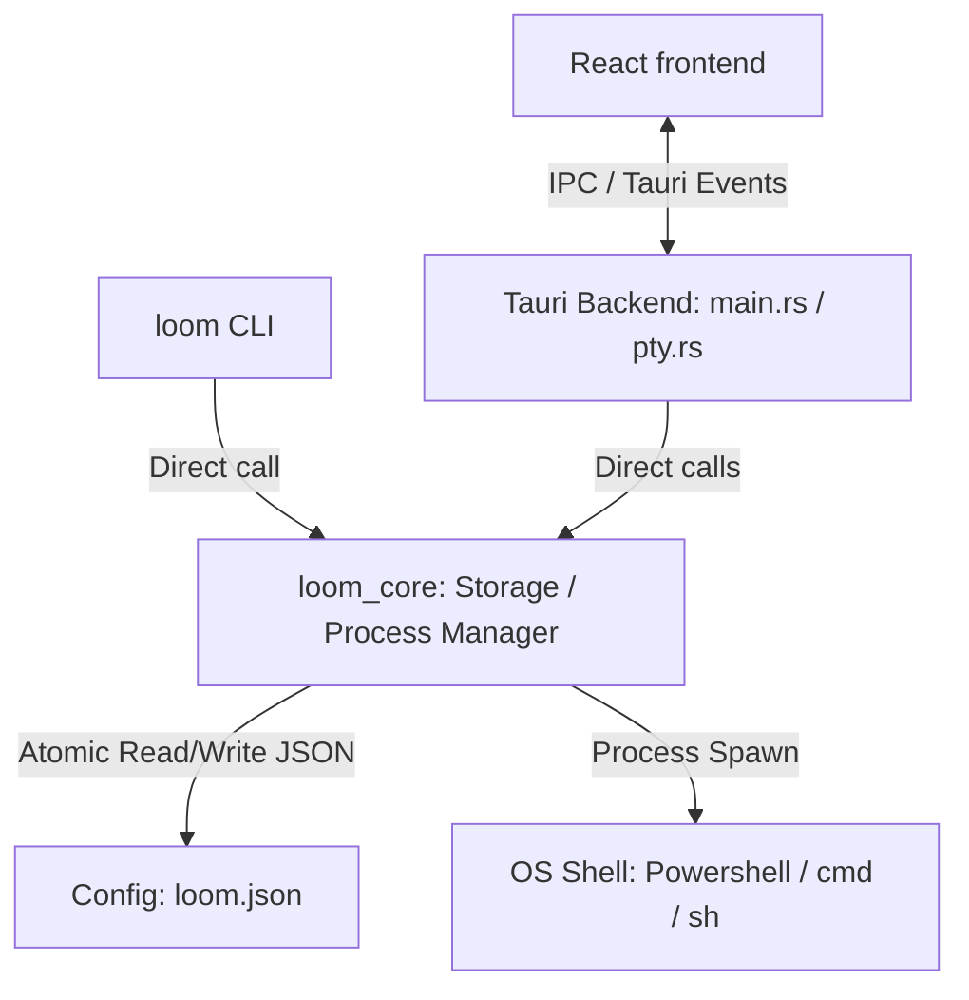

# Repository Guidelines

## Project Overview
Loom is a multi-project management and tool distribution system. It provides mechanisms for registering external CLI tools, defining execution templates with custom environment variables, organizing them into categories, and monitoring spawned workspace processes. It features both a CLI binary (`loom`) and a cross-platform desktop GUI built using React, TypeScript, and Tauri, with PTY terminal emulation (via xterm.js) and embedded text editors (via Monaco Editor).

---

## Architecture & Data Flow

### 1. Monorepo Composition
- **Workspace Resolution**: Managed via a Cargo workspace for Rust crates and a pnpm workspace configuration for Node projects (located in `e2e/`).
- **Core Library (`crates/core`)**: Handles data persistence, dynamic environment string resolution (e.g. `%VAR%` or `$VAR`), and child process orchestration.
- **CLI Wrapper (`crates/cli`)**: Validates input arguments, interacts with core storage, and directly forwards execution streams to registered binaries.
- **GUI Desktop App (`crates/gui`)**:
  - **Tauri Backend (`src-tauri`)**: Handles OS integrations, system tray logic, window state tracking, and PTY connection threads.
  - **React Frontend (`frontend`)**: Single-Page App rendering project views, Monaco text files editors, and interactive xterm.js terminal sessions.

### 2. Process & State Coordination
- **PTY Stream Multiplexing**: The Tauri backend interacts with `portable_pty` to keep active shell processes responsive. Standard I/O output bytes (`Vec<u8>`) are streamed asynchronously to the frontend using Tauri events (`pty-data-{sessionId}`).
- **Circular Terminal Buffers**: The Rust backend holds a circular memory buffer (up to 512KB) per shell session. Switchings views allows the UI to fetch terminal history and repaint via `pty_history`.
- **Windows Process Lifetime**: Background processes are assigned to a custom OS Job Object (`JOB_OBJECT_LIMIT_KILL_ON_JOB_CLOSE`) to ensure all nested process trees are destroyed instantly when Loom closes.
- **Synchronous Persistence**: Core configuration modifications execute synchronously with helper threads for log emission. Atomic write switches avoid state file corruption.

---

## Key Directories
- `crates/core/`: Rust library containing storage managers, error types, environment interpolation, and process wrappers.
- `crates/cli/`: Rust CLI wrapper binary source.
- `crates/gui/src-tauri/`: Rust desktop wrapper logic, Tauri commands, and portable PTY integration.
- `crates/gui/frontend/`: SPA Frontend using React 19, TypeScript, and Vite 8.
- `e2e/`: End-to-end integration test suite driven by Vitest.
- `specs/`: SDD feature-design files and specifications.
- `.agents/`: Automation scripts and custom Agent skills.

---

## Development Commands
Execute the following commands from the project root directory:

### Rust Crates (Core, CLI, Tauri)
- **Compile workspace**: `cargo build`
- **Lint Rust code**: `cargo clippy --all-targets`
- **Run Rust tests**: `cargo test`

### GUI Frontend
- **Install dependencies**: `npm install` (within `crates/gui/frontend/`)
- **Run dev live server**: `npm run dev`
- **Build assets**: `npm run build`
- **Lint TypeScript**: `npm run lint`

### Tauri Execution
- **Run GUI in development mode**: `npx tauri dev` or `cargo tauri dev`
- **Build release bundle**: `npx tauri build`

### End-to-End Tests (Vitest)
- **Install E2E dependencies**: `pnpm install` (within `e2e/`)
- **Run integration tests**: `pnpm --filter loom-e2e test` or `vitest run` (inside `e2e/`)

---

## Code Conventions & Common Patterns

### 1. General AI & Development Rules
- **Active Skills**: Use the `harnspec` framework for planning features and managing lifecycle tasks.
- **Communication Language / Target language**: **You MUST communicate in Simplified Chinese (简体中文) for all conversation, responses, and chats.**
- **Version Updates**: Maximum of 21 patches per minor version. Increment the minor version and reset the patch version to 1 once reached (e.g., `0.1.21` -> `0.2.1`).
- **GitHub Operations**: Perform all repository, issues, and PR interactions via the GitHub CLI (`gh`) tool.

### 2. Rust Idioms
- **Error Handling**: Use the standard `thiserror` crate inside `crates/core` to build typed `StorageError` variants. Never swallow errors silently.
- **Synchronous Storage**: Use `StorageManager` functions which employ temporary write swaps (`.tmp` to destination) to guarantee atomic writes.
- **Threading**: Rely on standard synchronous threads (`std::thread::spawn`) for process loop tracking and log streaming sidecars instead of complex async-await runtimes like `tokio`.
- **System Commands**: Spawn command tools cleanly using native commands or path structures with fallback shell wrappers on Windows (`pwsh`, `powershell`, or `cmd`).

### 3. Frontend / React Idioms
- **IPC Boundaries**: TypeScript interfaces in `crates/gui/frontend/src/types.ts` must align strictly with the Rust serialization structures found in `crates/core/src/storage/models.rs`.
- **Global Settings & Theme Rules**: Manage UI theme properties (themes, custom fonts, locales) using standard React contexts. Style elements utilizing raw CSS variables (`index.css`) on the `:root` pseudo-class for seamless real-time rendering.
- **IME Asian Characters**: When typing in terminal panels, absolute-position the underlying xterm textarea directly over the cursor location via computed style overrides (`--ime-left`, `--ime-top`) to prevent browser scroll mismatches.

### 4. Code Quality & Mod Rules
- **Surgical Code Updates**: Minimize diff size. Match single/double quoting and naming styles of surrounding files. Clean up unused imports or variables introduced by your own changes. Avoid full-file reformats.
- **Simplicity**: Prevent premature abstractions. Write direct execution paths. Avoid configurations for variables that will not change.

---

## Important Files
- `crates/core/src/storage/models.rs`: Master rust schemas for tools, configurations, templates, variables, and categories.
- `crates/core/src/storage/manager.rs`: Storage orchestration, environment parsing, command spawning, and process-tree termination.
- `crates/gui/src-tauri/src/main.rs`: Tauri command wrappers, window configurations, autostart plugins, and tray definitions.
- `crates/gui/src-tauri/src/pty.rs`: Implementation of interactive PTY sessions using target-specific job tracking.
- `crates/gui/frontend/src/api.ts`: Typed bridge mapping Tauri IPC calls to React hooks.
- `e2e/src/cli.test.ts` & `gui.test.ts`: Automated test assertions validating process actions and mocking Tauri command interfaces.

---

## Runtime/Tooling Preferences
- **Rust Toolchain**: 2021 Edition.
- **Node Runtime**: Bun or Node.js environment. Use `pnpm` workspace constraints for test runners, and raw `npm` commands for standard frontend directory work.
- **GUI Engine**: Tauri v2.x.
- **External UI Libs**: Monoco React component and Xterm.js v6.x (incorporates webgl and fit addons).

---

## Testing & QA
- **Unit Testing**: Rust unittests reside in `crates/core/src/storage/tests.rs`. Use the static sequence `TEST_MUTEX` to run tests sequentially, as environment variables (`LOOM_CONFIG_PATH`) are shared process-wide.
- **E2E Integration Testing**: Run via Vitest in the `e2e/` folder. Uses `execa` to execute binary instances in isolated environments.
- **Mockauri Execution**: During test runs, GUI Tauri execution does not spawn web views. Setting `TAURI_TEST_CMD` and `TAURI_TEST_ARGS` lets the binary run headless and print JSON structures to stdout for assertion parsing.
- **State Redirection Isolation**: Prevent user state mutation during testing by pointing the standard storage manager to temporary config files using the `LOOM_CONFIG_PATH` env variable.