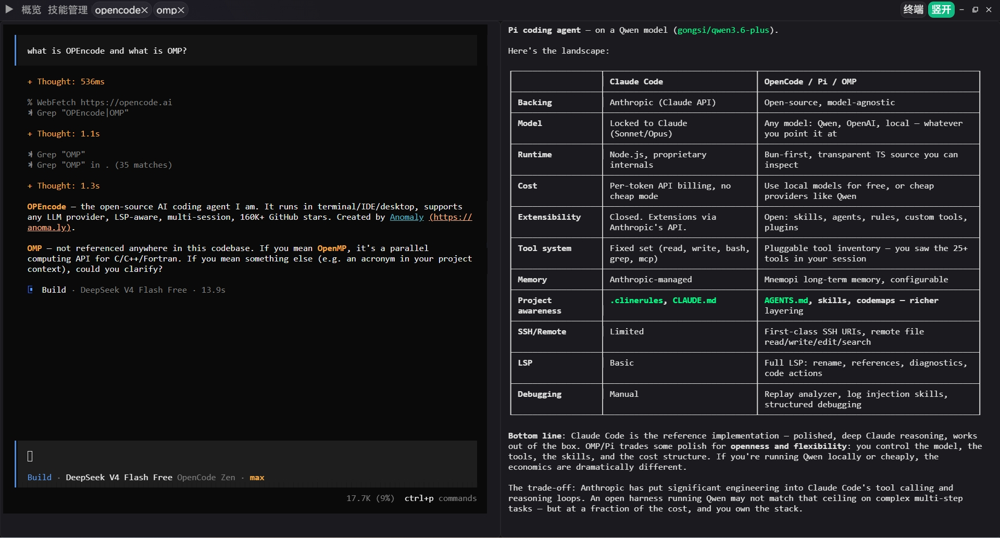

<p align="center">
  
</p>

<p align="center">
  <a href="https://github.com/loomd/loom/actions/workflows/ci.yml"></a>&nbsp;<a href="https://github.com/loomd/loom/releases"></a>&nbsp;<a href="LICENSE"></a>
</p>

Loom 是一个支持多项目统一管理，多 agent 并行开发的终端管理工具，集成了文件管理和skills管理的功能。

## 功能

### 1. 项目管理

管理项目文件、Skill、AGENTS.md，每个项目独立维护自己的配置和文档。

### 2. 本地 Agent 自动发现

自动扫描本地安装的命令行工具，支持手动注册。无需逐个添加，发现即可使用。

### 3. AI Agent 环境隔离

为每个 agent 分配独立的环境，注入自定义的环境变量，避免不同项目之间的配置冲突。
支持同一个agent 多个不同配置并发，只需配置模板即可

### 4. Agent Terminal 聚合

将多个 agent 的终端窗口集中管理，一个界面查看所有 agent 的运行状态和日志输出。

## 快速开始

### 下载

- **安装包**：前往 [Releases](https://github.com/loomd/loom/releases) 下载最新的 `.exe`
- **免安装版**：同时提供 `.zip` 免安装包，解压即用

### 开发

```bash
git clone https://github.com/loomd/loom.git
cd loom
```

前端依赖安装：
```bash
cd crates/gui/frontend
npm install
```

运行开发模式：
```bash
cargo tauri dev
```

## 许可证

**Functional Source License, Version 1.1, ALv2 Future License（FSL-1.1-ALv2）**

Loom 采用 Fair Source 协议。你可以自由使用、修改、fork 与再分发，包括发布闭源的衍生作品；但**禁止将 Loom 用于构建与本项目竞争的商业产品或服务**。内部使用、非商业研究、以及为已获许可用户提供专业服务均属允许。

每个版本在发布满两年后，会**自动转为 Apache-2.0**（不可撤销）。商标 "Loom" 不在授权范围内。

版本协议历史与商业授权请联系见 [LICENSING.md](LICENSING.md)，商标规则见 [TRADEMARKS.md](TRADEMARKS.md)。

---

[English](README_EN.md)
