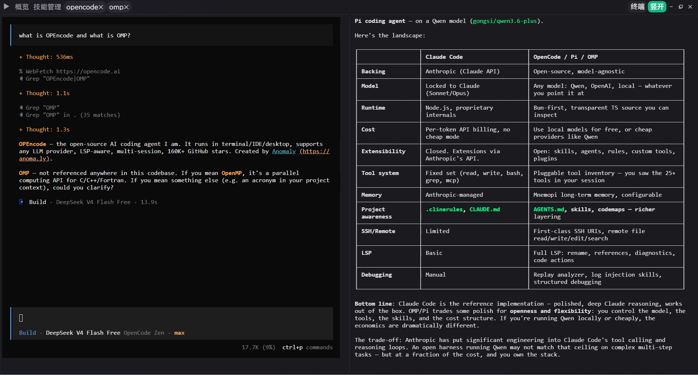

<p align="center">
  
</p>

<p align="center">
  <a href="https://github.com/loomd/loom/actions/workflows/ci.yml"></a>&nbsp;<a href="https://github.com/loomd/loom/releases"></a>&nbsp;<a href="LICENSE"></a>
</p>

## Loom

Multi-Project Management & Multi-Agent Parallel Development.

## Features

### Project Management

Manage project files, skills, and AGENTS.md with independent configuration per project.

### Local Agent Discovery

Automatically scans locally installed CLI tools with support for manual registration. Just discover and use.

### AI Agent Environment Isolation

Each agent gets its own isolated environment with custom variables, preventing configuration conflicts across projects.

### Agent Terminal Aggregation

Centralized terminal management across all agents. View every agent's status and logs in one place.

## Quick Start

### Download

- **Installer**: Get the latest `.exe` from [Releases](https://github.com/loomd/loom/releases)
- **Portable**: A `.zip` package is also available - unzip and run

### Development

```bash
git clone https://github.com/loomd/loom.git
cd loom
```

Install dependencies:
```bash
cd crates/gui/frontend
npm install
```

Run in development mode:
```bash
cargo tauri dev
```

## License

MIT License.

---

[中文](README.md)